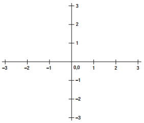
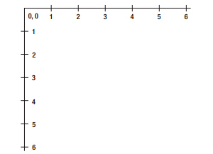
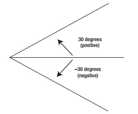
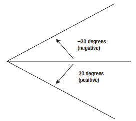

#01.canvas的二维坐标系与角度

##1.1 二维坐标系

在标准的数学坐标系中，坐标系如下图所示：

但是在计算机中所使用的坐标系跟数学中的标准坐标系有所不同，如下图所示：

如果觉得混乱的话，不妨想想css中的坐标体系。

##1.2 二维角度

在标准的数学坐标系旋转角中，角度如图所示：

以x轴为正方向，逆时针旋转所得的角为**正角**，顺时针旋转所得的角为**负角**。

由于计算机中所用的坐标系与标准的数据坐标系不同，旋转角的正负也有差异，以下为计算机中，旋转角的正负方向：

以x轴为正方向，逆时针旋转所得的角为**负角**，顺时针旋转所得的角为**正角**。
