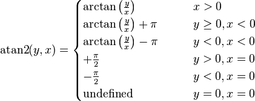

#02.Math.atan2三角函数

在三角函数中，两个参数的函数atan2是**正切函数**的一个变种。

对于任意不同时等于0的实参数x和y，**atan2(y,x)**所表达的意思是坐标原点为起点，指向(x,y)的射线在坐标平面上与x轴正方向之间的角的角度。

当y\>0时，射线与x轴正方向的所得的角的角度指的是x轴正方向绕逆时针方向到达射线旋转的角的角度；
而当y\<0时，射线与x轴正方向所得的角的角度指的是x轴正方向绕顺时针方向达到射线旋转的角的角度。

在**[-PI/2,PI/2]**区间，**Math.atan2**的函数定义如下如下：

